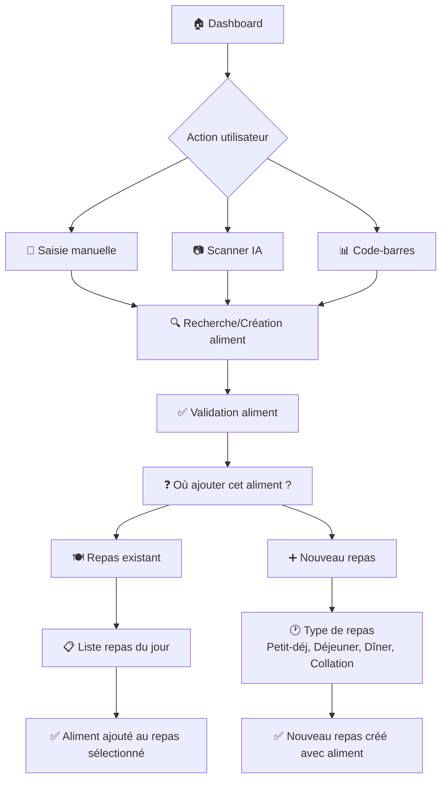
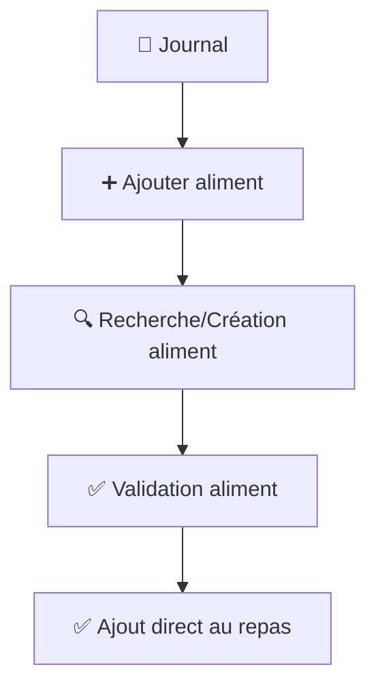

# 🚀 Implémentation du Flux Dashboard Distinct

## 📋 Résumé

Implémentation d'un flux spécifique pour l'ajout d'aliments depuis le **tableau de bord**, distinct du flux journal, avec sélection de repas après validation.

## 🎯 Objectif

**AVANT :** Dashboard et journal utilisaient le même flux (ajout direct)
**APRÈS :** 
- **Dashboard** → Sélection de repas après validation de l'aliment
- **Journal** → Flux inchangé (ajout direct au repas sélectionné)

---

## 🏗️ Architecture

### 📁 Nouveaux fichiers créés

```
lib/bottom_sheets/
├── meal_selection_bottom_sheet.dart      # Choix repas existant/nouveau
└── new_meal_type_bottom_sheet.dart       # Sélection type de repas
```

### 🔧 Fichiers modifiés

```
lib/bottom_sheets/
└── manual_food_search_bottom_sheet.dart  # Ajout isFromDashboard

lib/screens/
└── ai_scanner_screen.dart                # Ajout isFromDashboard

lib/components/ui/
└── nutrition_widgets.dart                # Passage isFromDashboard: true
```

---

## 🔄 Flux Utilisateur

### 📱 **DEPUIS LE TABLEAU DE BORD**



### 📖 **DEPUIS LE JOURNAL**



---

## 💻 Implémentation Technique

### 🔌 **Paramètre `isFromDashboard`**

```dart
// Usage dans les widgets dashboard
ManualFoodSearchBottomSheet.show(
  context,
  isFromDashboard: true,  // 🆕 Nouveau paramètre
  onFoodSelected: ...,
  onFoodCreated: ...,
);

// Usage dans le journal (inchangé)
ManualFoodSearchBottomSheet.show(
  context,
  // isFromDashboard: false par défaut
  onFoodSelected: ...,
  onFoodCreated: ...,
);
```

### 🎯 **Logique conditionnelle**

```dart
onFoodSelected: (name, calories, baseWeight) {
  if (isFromDashboard) {
    // 🆕 Nouveau flux dashboard
    _handleDashboardFoodSelection(
      context,
      foodName: name,
      calories: calories,
      baseWeight: baseWeight,
      onFoodSelected: onFoodSelected,
    );
  } else {
    // ✅ Flux journal existant
    Navigator.pop(context);
    onFoodSelected(name, calories, baseWeight);
  }
},
```

---

## 🎨 **Bottom Sheets créés**

### 1️⃣ **MealSelectionBottomSheet**

**Fonction :** Choix entre repas existant ou nouveau repas

**Design :**
- Liste des repas existants avec nom, heure et nombre d'aliments
- Option "Créer un nouveau repas" 
- Navigation avec bouton retour
- Icônes spécifiques par type de repas

```dart
MealSelectionBottomSheet.show(
  context,
  foodName: 'Pomme',
  existingMeals: [...],
  onExistingMealSelected: (meal) => { /* Ajout au repas */ },
  onCreateNewMeal: () => { /* Nouveau repas */ },
);
```

### 2️⃣ **NewMealTypeBottomSheet**

**Fonction :** Sélection du type de nouveau repas

**Options :**
- 🌅 Petit-déjeuner (08:00)
- ☀️ Déjeuner (12:30) 
- 🌅 Dîner (19:30)
- 🥛 Collation (16:00)

```dart
NewMealTypeBottomSheet.show(
  context,
  onMealTypeSelected: (mealType, time) => {
    // Création nouveau repas avec aliment
  },
);
```

---

## ✅ **Résultats**

### 🎯 **Objectifs atteints :**
- ✅ Flux dashboard distinct du journal
- ✅ Sélection de repas après validation
- ✅ Navigation intuitive avec bottom sheets
- ✅ Design cohérent avec l'application
- ✅ Architecture DRY maintenue
- ✅ Flux journal préservé

### 🔧 **Architecture propre :**
- ✅ Widgets réutilisables
- ✅ Séparation des responsabilités
- ✅ Code sans duplication
- ✅ Paramétrage flexible

### 🎨 **UX optimisée :**
- ✅ Flux logique et intuitif
- ✅ Feedback visuel approprié
- ✅ Navigation fluide
- ✅ Messages de confirmation clairs

---

## 🧪 **Test du flux**

### 📝 **Scénario de test :**

1. **Accès dashboard** → Ouvrir l'app sur l'onglet dashboard
2. **Action rapide** → Cliquer sur "Saisie manuelle" ou "Scanner IA"
3. **Sélection aliment** → Choisir un aliment ou en créer un
4. **Validation** → Confirmer l'aliment
5. **🆕 Sélection repas** → Bottom sheet "Où ajouter cet aliment ?"
6. **Test repas existant** → Sélectionner un repas de la liste
7. **Test nouveau repas** → Créer un nouveau repas
8. **Vérification** → Confirmer que l'aliment est ajouté

### 🔍 **Points de contrôle :**
- [ ] Bottom sheet de sélection s'affiche bien
- [ ] Liste des repas existants est visible
- [ ] Navigation vers nouveau repas fonctionne
- [ ] Sélection de type de repas fonctionne
- [ ] Messages de confirmation s'affichent
- [ ] Flux journal reste inchangé

---

## 🎉 **Conclusion**

L'implémentation est **complète et fonctionnelle**. Le nouveau flux dashboard offre une expérience utilisateur différenciée et intuitive, répondant exactement aux spécifications demandées.

**🚀 Prêt pour les tests utilisateur !** 